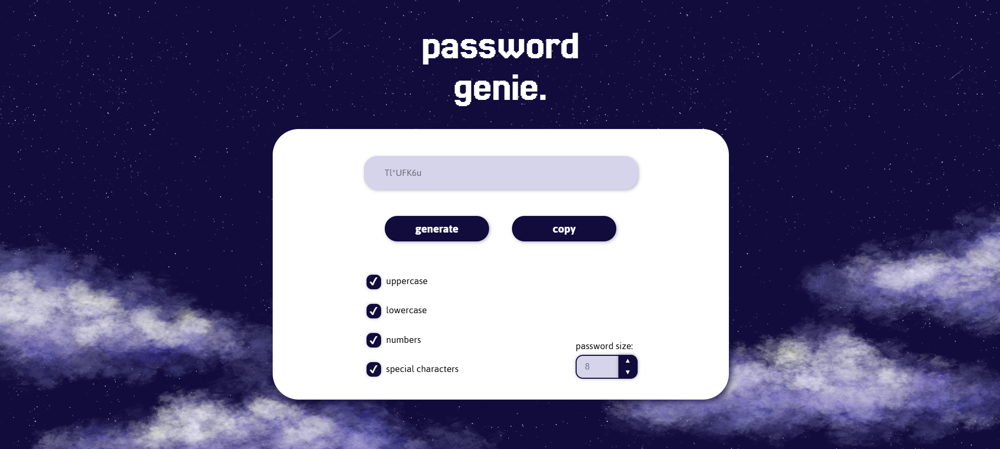

# Password Genie: A Simple and Cute Password Generator

Welcome to **Password Genie**, a user-friendly password generator with a charming night sky theme. This project combines functionality and aesthetics to help you create secure passwords with ease.

---

## 🌟 Features

- **Secure Passwords**: Generates random passwords to enhance your online security.
- **Customizable Options**: Choose the length and complexity of your passwords.
- **Beautiful Night Sky Theme**: Enjoy a soothing celestial design while generating passwords.
- **User-Friendly Interface**: Simple and intuitive design for all users.

---

## 🚀 Getting Started

### 1. Clone the Repository

```bash
git clone https://github.com/mariedias/password-genie.git
```

### 2. Navigate to the Project Directory

```bash
cd password-genie
```

### 3. Open the Application

Simply open the `index.html` file in your favorite browser to start using the password generator.

---

## 🛠️ Technologies Used

- **HTML**: Structure of the application.
- **CSS**: Styling the night sky theme.
- **JavaScript**: Logic for generating secure passwords.

---

## 📸 Screenshots

### Password Generator Interface:



---

## 📄 License

This project is licensed under the [MIT License](LICENSE).

---

## 🌌 Acknowledgments

- Inspired by the beauty of the night sky.
- Created with love for simplicity and security.


 
